# Steps to Install and Enable Backup Compatibility of Bold BI on AWS EC2 Linux instance

| SEO Details       |                                                                     |
|-------------------|---------------------------------------------------------------------|
| Meta Title        | Installing and Enabling Backup Compatibility for Bold BI on  AWS EC2 Windows instance |
| Meta Description  | Learn how to install Bold BI on AWS EC2 Windows instance and enable backup compatibility with easy-to-follow steps. Ensure data protection and disaster recovery for your Bold BI installation. |

## Below are the steps that will help you to install Bold BI.

### 1. Launch an EC2 Linux instance on AWS
   - To create an EC2 Linux instance in AWS, refer to this [link](https://docs.aws.amazon.com/AWSEC2/latest/UserGuide/EC2_GetStarted.html#ec2-launch-instance).

### 2. Setup RDS (Relational Database Service) for PostgreSQL
If you want to set up a PostgreSQL Database on EC2 Linux instance, follow the first step. If you prefer using a managed RDS in AWS, follow the second step.

#### a. Setting up PostgreSQL in a EC2 Linux instance
To install PostgreSQL on Linux, you can use the package manager specific to your distribution. Here are the commands for some common distributions:
1. **Ubuntu/Debian**:
   ```bash
   sudo apt update
   sudo apt install postgresql postgresql-contrib
2. **CentOS/RHEL**:
    ```bash
    sudo yum install postgresql-server postgresql-contrib
    sudo postgresql-setup initdb
    sudo systemctl start postgresql
    sudo systemctl enable postgresql
**Information:**
  - For installing a MySQL database in a Linux EC2 instance, refer to the steps outlined in this [guide](https://www.devart.com/dbforge/mysql/how-to-install-mysql-on-linux/).
  - To install an MS SQL database in Windows EC2 instance, follow the instructions provided in this [guide](https://phoenixnap.com/kb/sql-server-linux).

#### b. Setting up PostgreSQL RDS in AWS
- To create an PostgreSQL RDS in AWS, refer to this [link](https://aws.amazon.com/getting-started/hands-on/create-connect-postgresql-db/).

**Information:** 
  - To create a MySQL RDS in AWS, follow the instructions in this [link](https://aws.amazon.com/getting-started/hands-on/create-mysql-db/).
  - To create a MS SQL RDS in AWS, follow the instructions in this [link](https://aws.amazon.com/getting-started/hands-on/create-microsoft-sql-db/).


### 3. Bold BI Installation
   - Download different versions of Bold BI from [here](https://www.boldbi.com/account/downloads) and proceed with installation.
   - Refer this [document](https://help.boldbi.com/deploying-bold-bi/deploying-in-linux/installation-and-deployment/bold-bi-on-ubuntu/#bold-bi-installation-and-deployment-on-ubuntu) to install Bold BI in linux
   - For guidance on startup configuration for Bold BI, refer to this [link](https://help.boldbi.com/application-startup/latest/).

**Note:**

     During the startup configuration, please remember the name of the database as it will be used in resetting the database.

### 4. DNS Mapping and Binding with Bold BI Application

- Map IP Address to Domain Name
  - Log in to your domain registrar's website.
  - Navigate to the DNS management section.
  - Create an A record that points your domain name to the IP address of your VM.
- When executing the following command to deploy Bold BI on your Linux machine, remember to replace the host URL with your domain name.
   ```bash
      sudo bash install-boldbi.sh -i {new} -u {user} -h {host URL} -n {true or false} 

**Note:**

   If you are setting up DNS mapping for your virtual machine (VM), it is essential to also map the snapshot of your VM. Alternatively, if you are not using mapping, you will need to use the upgrade command in the Snapshot VM and replace the host URL with the IP address of your Snapshot VM.


## To Enable Backup compatibility of Bold BI application

### 1. Create a snapshot of an EC2 Linux instance
- Go to your EC2 instance and select the "Storage" tab, then the EC2 instance Volume.
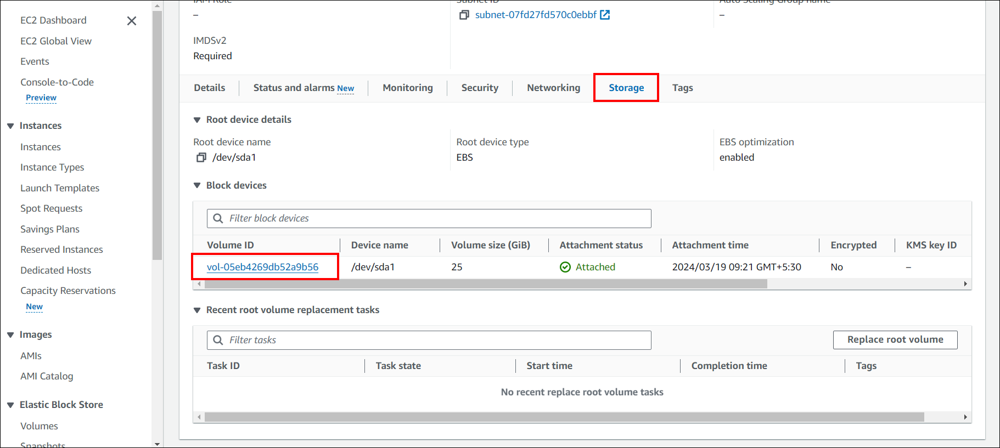
- Choose your EC2 instance volume, and in the upper right corner, click "Action" and select the "Create Snapshot" button.
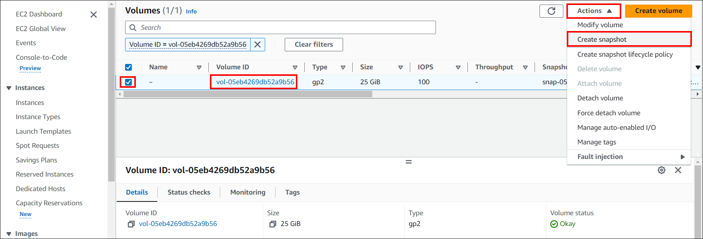
- A new window will appear. Enter the Description which is optional and click "Create snapshot".
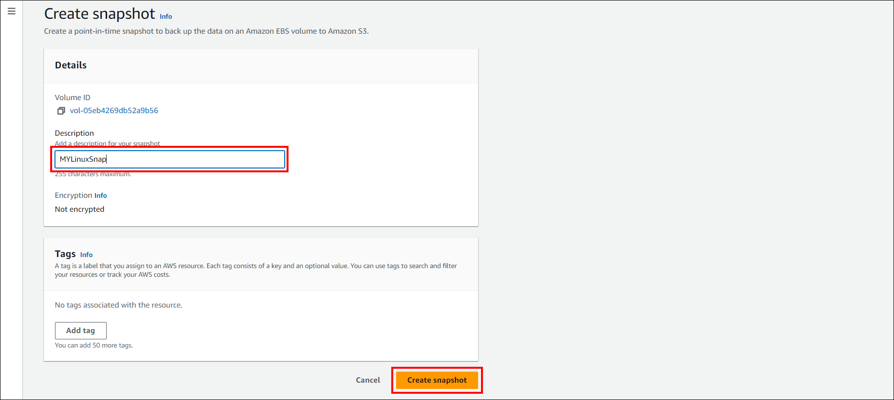
- Once the snapshot is created, it will appear in the list of snapshots in the Amazon EC2 console.
- For complete instructions to make a snapshot of an EC2 Windows instance, follow this [guide](https://docs.aws.amazon.com/ebs/latest/userguide/ebs-creating-snapshot.html).

To restore a virtual machine (EC2 instance) from a snapshot in AWS, you would indeed first create an Amazon Machine Image (AMI) from the snapshot, and then use the AMI to launch a new EC2 instance. 
### 2. To create an AMI image from the snapshot
- In the navigation pane, under "ELASTIC BLOCK STORE", select "Snapshots" then select your Snapshot that you created in above step then click on the "Action" button on the above right and click on "Create image from snapshot".
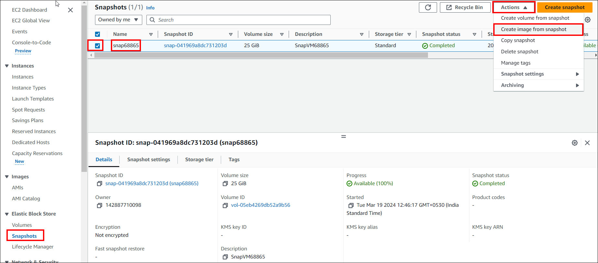
- Enter a name for the AMI in the "Image name" field.Optionally, enter a description for the AMI in the "Image description" field.Choose an architecture for the AMI (e.g., 64-bit or 32-bit).
Select the instance type for the AMI (e.g., t2.micro, m5.large, etc.).Configure other instance details as needed.
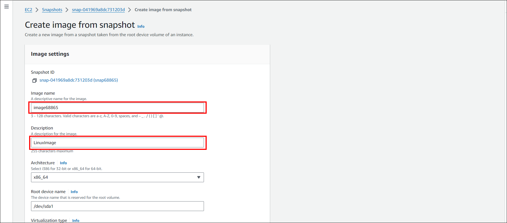
- Review the AMI configuration and click on the "Create image" button to create the AMI.
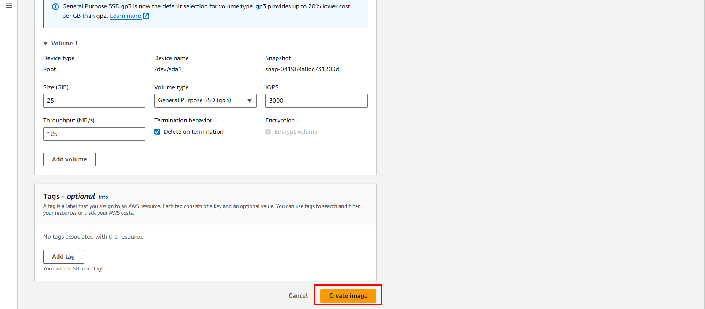
- Once the AMI is created, it will appear in the list of AMIs in the Amazon EC2 console.
- For complete instructions to create an AMI image from the snapshot, refer to this [link](https://docs.aws.amazon.com/AWSEC2/latest/WindowsGuide/Creating_EBSbacked_WinAMI.html).

### 3. Create a snapshot of an RDS instance
- In the navigation pane, choose "Databases".
Select the RDS instance for which you want to create a snapshot. In the "Action" dropdown menu, choose "Take snapshot".
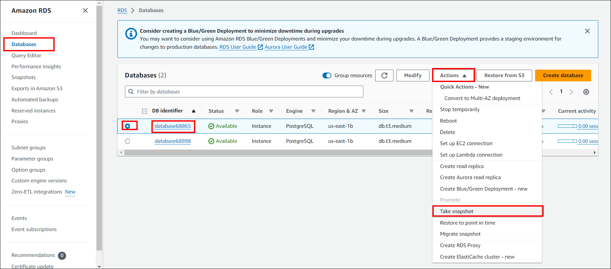
- Enter a name for the snapshot in the "Snapshot name" field. Click on the "Take snapshot" button to create the snapshot.
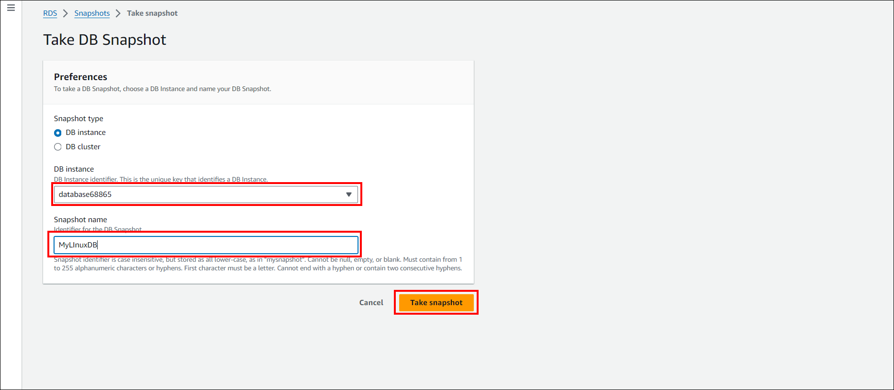
- For complete instructions to Create a snapshot of an RDS instance refer to this [link](https://docs.aws.amazon.com/AmazonRDS/latest/UserGuide/USER_CreateSnapshot.html)

### 4. Restore the EC2 instance from AMI
- In the navigation pane, under "Images", select "AMIs". Select the AMI you want to use to restore your EC2 instance. Right-click on the selected AMI and choose "Launch Instance" from the context menu.
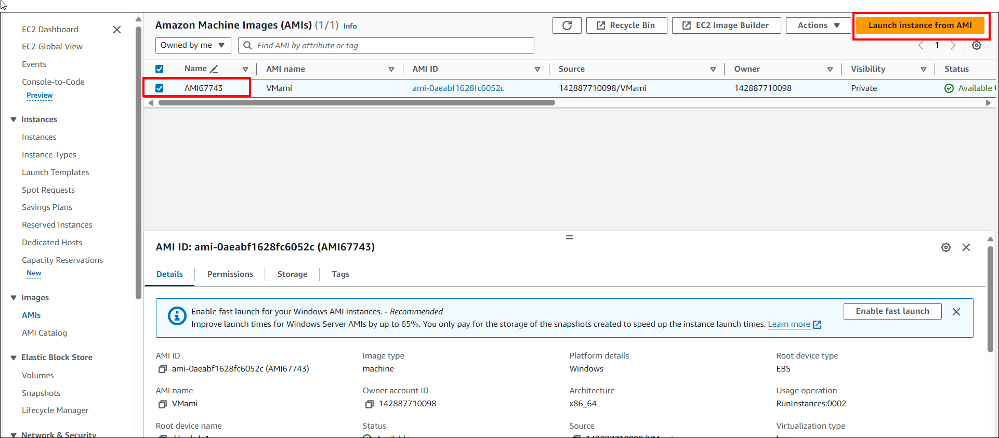
- Follow the instance launch wizard to configure your new EC2 instance. Enter the instance name, Select the instance type, configure networking, and add storage as needed. Review the instance details and click on the "Launch" button.If required, select an existing key pair or create a new one to access your instance securely.
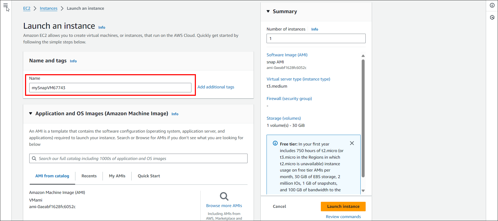
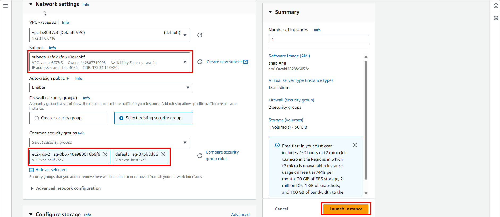
- Once the instance is launched, you can access it using the specified key pair and any necessary credentials.
- For detailed instructions on how to restore a VM from a snapshot image, refer to the following [link](https://aws.plainenglish.io/a-step-by-step-guide-to-restoring-an-ec2-instance-from-a-snapshot-58922be4b3b6)

### 5. Restore the RDS from Snapshot
- Go to the Amazon RDS console. In the navigation pane, choose "Snapshots". Select the snapshot you want to restore from.
- Click on the "Actions" dropdown menu and select "Restore snapshot".
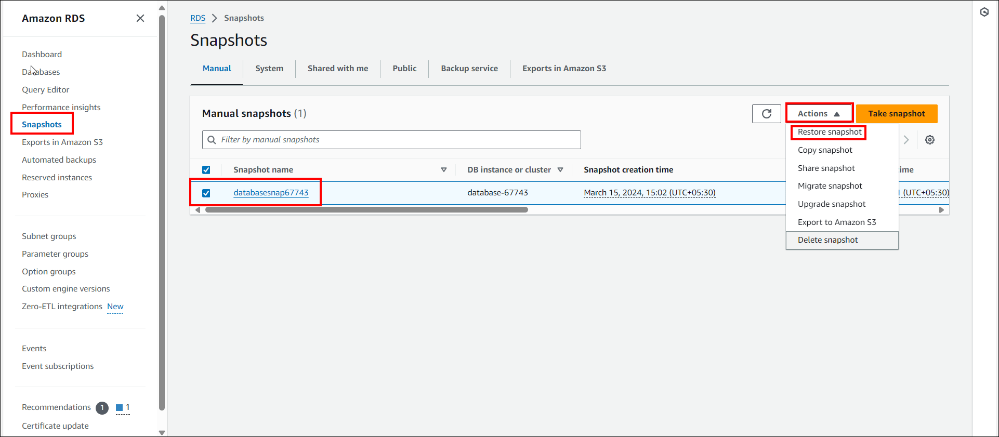
- Enter a new DB instance identifier for the restored instance. Choose the DB instance class for the new instance. Configure other settings such as storage, network, and database options as needed.
- Click on the "Restore DB instance" button to start the restoration process.
- Once the restoration is complete, verify that the new RDS instance is available and functioning as expected.
- For detailed instructions on how to restore a DB from a snapshot, refer to the following [link](https://docs.aws.amazon.com/AmazonRDS/latest/UserGuide/USER_RestoreFromSnapshot.html)

## 6. Reset the Connection string to use restored PostgreSQL Database

- To use the restored database, you'll need to reset the database on your Virtual Machine.
Detailed steps can be found in the following documentation: [Reset Application Database on Windows](https://help.boldbi.com/utilities/bold-bi-command-line-tools/reset-application-database/#linux)